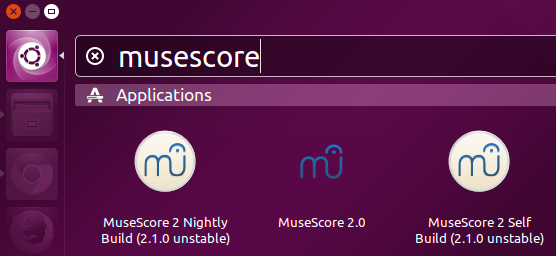

# Linux & BSD Compiling

This guide is for compiling MuseScore from the source code __for testing and/or contributing purposes__.  If you just want to test (and not contribute code changes) then you may find using a pre-compiled [Development Build](https://musescore.org/en/download#Nightly-versions) easier than compiling.

You shouldn't use this method to install MuseScore for everyday score editing. Instead, get the latest official release from the [Downloads page](https://musescore.org/download). (Of course, if there's no package for your distribution then you have no choice but to compile.)

* [Ubuntu](Linux_Ubuntu_Compiling.md)
* [Fedora](Linux_Fedora_Compiling.md)
* [OpenSUSE](Linux_OpenSUSE_Compiling.md)
* [Arch-based](Linux_Arch_Compiling.md)

## Install dependencies

Dependencies are the other programs, libraries and packages that are needed to compile and run MuseScore and its plugins. Dependencies can be:

### Build dependencies

* Needed to compile MuseScore's code but not necessarily needed to run the compiled program.
* Needed by developers but not by end users.

### Runtime dependencies

* Needed to run the program but not necessarily needed to compile the code.
* Needed by developers and users.

### Optional dependencies

* Could be needed at build or runtime to enable certain features.
* If these are missing the the program can still be compiled/run but the relevant features will be disabled.
* Most users will want these!

The exact dependencies needed, and the method for getting them, will be different for each distribution.

## Get the source code

MuseScore uses Git for version control. Use these commands to get MuseScore's source code for building and testing purposes. (If you want to make changes to the code then substitute the clone URL for the URL of your own fork of MuseScore on Github, and also read [Git workflow](../WorkflowAndGuidelines/GitWorkflow.md) page)

### To get the latest code

```bash
git clone git://github.com/musescore/MuseScore.git
cd MuseScore
```

Note: the `git clone` command will put the code in a new folder called "MuseScore", so we use "cd" to enter the MuseScore directory. All subsequent commands in this guide should be run from the "MuseScore" directory.

### To get a specific branch or tag

```bash
# Fetch only the files required by (for example) the v2.0.2 tag:
# Note: Simply remove "--depth 1" if your git doesn't have that argument.</i>
git clone --depth 1 git://github.com/musescore/MuseScore.git --branch v3.4.2
cd MuseScore
```

This is useful if you were forced to compile MuseScore because no package was available for your distribution, or if you are building a package. Tags are more stable than development branches so their use is recommended in this situation.

## Build an executable file

Firstly, you should update the revision number that will be displayed in MuseScore's Help -> About dialog. This is useful for tracking issues so __this step should be done by everyone, including package maintainers__. Simply do:

```bash
make revision
```

If you __don't__ already have a copy of MuseScore installed on your machine then you can compile the usual way:  
__This causes conflicts if multiple versions are present and therefore is NOT RECOMMENDED__

```bash
make
sudo make install
```

This creates an executable file `/usr/local/bin/mscore` which can be run by typing `mscore` in the terminal.

However, if you __do__ have (or plan to have) another version of MuseScore installed (e.g. via your distribution's package manager) then you'll probably want to be able to distinguish between them, so do this instead:  
__Use SUFFIX and LABEL if multiple versions are installed to distinguish between them__

```bash
make SUFFIX="-self" LABEL="Self Build"
sudo make SUFFIX="-self" LABEL="Self Build" install
```

_NOTE: `make install` is required, even for development. Because when runtime, __built executable__ (`CMAKE_BINARY_DIR/mscore/mscore`) needs some installed files, for example, soundfonts, which is located at `/usr/local/share/mscore-VERSION/sound/`. Running the __built executable__ without `make install` will cause crash._

This creates an executable file `/usr/local/bin/mscore-self` which can be run by typing `mscore-self` in the terminal. Alternatively, you can click on the relevant icon from your desktop launcher:


The label "Self Build" allows you to distinguish your compiled version from any other versions you might have installed (e.g. official releases or nightly builds). You can set SUFFIX and LABEL to anything you want (but no spaces in SUFFIX).

## Additional information

You can stop reading here if you want. The following section is not required. However, it may give you some tips about custom installation or optional post-installation tasks.

### Custom installation path

_NOTE: it is no longer necessary to use PREFIX to avoid `$PATH` conflicts when installing multiple versions (you can use SUFFIX and LABEL instead). Of course, you might have other reasons for using PREFIX._

If you want to install MuseScore elsewhere (not in the default location `/usr/local`), you can specify the path as follows:

```bash
make revision
make PREFIX=$HOME/software
make PREFIX=$HOME/software install
```

In this example, a local installation (only for the current user; no root privileges needed) is done. The resulting executable file is `bin/mscore`, located in the folder specified during build. For the above example, this gives `$HOME/software/bin/mscore`.

### Keeping the source code up-to-date

_NOTE: for more info about the development process with `git`, see [Git workflow](../WorkflowAndGuidelines/GitWorkflow.md)._

The source code previously downloaded with `git` can be updated locally. Only new commits will be retrieved:

```bash
cd MuseScore
git pull
```

_NOTE about the first command: the folder `MuseScore` is the one created by `git` and where you performed the compilation._

After updating you will need to compile again using:  
__Remember to change SUFFIX and LABEL here if you set them to something else previously__

```bash
make revision
make SUFFIX="-self" LABEL="Self Build"
sudo make SUFFIX="-self" LABEL="Self Build" install
```

`make` is clever and it will only get the compiler to compile the new files; unchanged files and files where no dependency has changed will not be recompiled, so it should be much faster than the initial compile. However, sometimes errors occur during compilation and it will be necessary to start again from scratch. To do this you must delete all of the intermediate object files (of which there are many!) that are created in the source code folder during compilation. Fortunately, there is a simple command to do this for you:

```bash
make clean
```

 The next time you try to compile the code, it will start anew.

_NOTE: before using `make clean` you should read the notes for "Uninstalling MuseScore" (immediately below)._

## Uninstalling MuseScore

There is a Makefile target to uninstall, so removing MuseScore is effortless:

```bash
sudo make uninstall
```

Obviously you must run this from within the `MuseScore` source code folder (created by `git`) where you performed the compilation.

NOTE:

* You should always run `make uninstall` before you run `make clean` because it is not possible to do so afterwards.
* When running `make uninstall` or `make clean` it is not necessary to specify any variables (PREFIX, SUFFIX, etc.) even if you specified them during compilation.
* In the past there have been occasions where `make uninstall` was unavailable or broken on the latest development branch. In such cases, your last resort is to use a more arbitrary and dirty way to uninstall:

```bash
xargs rm < install_manifest.txt
```

## Tools for editing and debugging

MuseScore is a sophisticated program made up of millions of lines of code split among thousands of files. Although it is possible to edit the code in any text editor and build from the command line, there are specialised tools to make the challenge of coding and spotting errors in such a huge project much easier to manage:

### QtCreator IDE - method 1

This is the normal way (but not necessarily the best way) to configure QtCreator for a CMake project. The advantage of this method is that Qt Creator does most of the setup and configuration for you. The disadvantage is that the CMake configuration can break from time-to-time when MuseScore's CMakeLists.txt are changed. This method also makes it more difficult to compile MuseScore from the Terminal should you need to do so.

* If you haven't already, checkout MuseScore's code using Git (see main compilation guide above).
* Within Qt Creator, open `./CMakeLists.txt` as your project file.
* When QtCreator asks for command line options for cmake, use
`-G"Unix Makefiles" -DCMAKE_BUILD_TYPE=DEBUG`
* When QtCreator asks to Choose CMake Executeable, it's probably located at `/usr/bin/cmake`

To install MuseScore so all features will be available (e.g. SoundFonts and templates) do the following:

* In "Build settings" set the Cmake setting `CMAKE_INSTALL_PREFIX` to "install". Remember to click "Apply Configuration Changes".
* In "Run settings"
  * add a deploy step where target is install (`cmake --build . --target install)`.
  * Then add a "Custom Executable" run configuration with executable set to `%{buildDir}/install/bin/mscore`.

### QtCreator IDE - method 2

This method bypasses QtCreator's built-in handling of CMake and simply specifies some Terminal commands to build and run MuseScore. This makes it easier to build MuseScore outside of Qt Creator and ensures that you always use an up-to-date CMake configuration.

* If you haven't already, checkout MuseScore's code using Git (see main compilation guide above).
* Within Qt Creator, go to File -> New File or Project
* Select "Import Project" and "Import Existing Project". Click "Choose".
* Name: "MuseScore_Linux", location: `~/src/MuseScore` (or wherever the Git repo is on your system). Click "Next".
* Add `*.ui` to the list of file types to be shown, and `*` to the list of types to be hidden (hides everything else) and then apply the filter.
* Uncheck all directories except `libmscore`, `mscore` and `mtest` and then click "Next".
* [Optional] Add the project to Git version control and click "Finish". (I prefer to use Git from the command line.)
* Now click the "Projects" button on the left side of the QtCreator window and modify the build and run configurations as follows:

#### Build settings

__Build directory:__

```text
    ~/src/MuseScore (or wherever the code is located)
```

__Build steps:__

```bash
make revision
make installdebug PREFIX=install SUFFIX=-qt LABEL="QtCreator Build" UPDATE_CACHE=FALSE
```

__Clean steps:__

```bash
make uninstalldebug
make clean
```

__Build environment:__ Use System Environment

#### Run settings

__Executable:__ `build.debug/install/bin/mscore-qt`  (this file won't exist until you run the build for the first time)  
__Working directory:__ `%{buildDir}`

Using the Makefile means that you always use the same build configuration as Travis. If the CMake options are changed by a PR then your configuration is updated automatically when you fetch and merge the changes from upstream.
