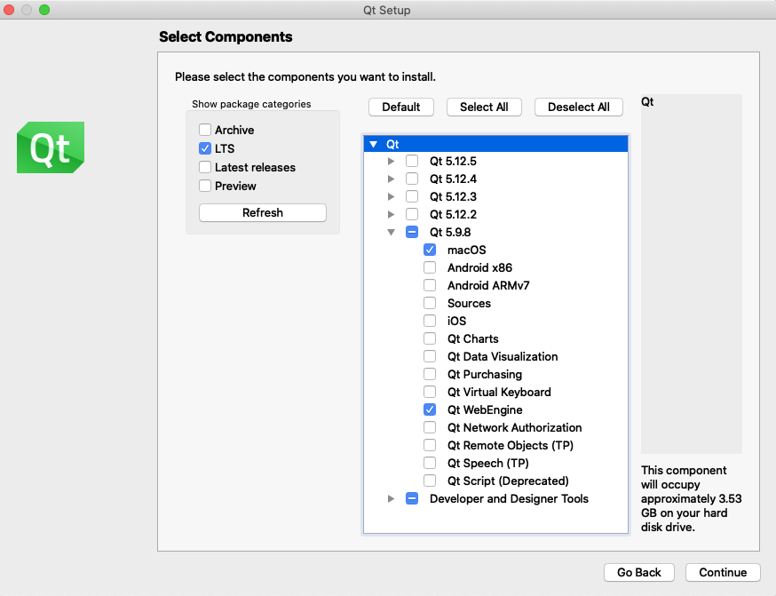

# Mac Compile instructions

Use these instructions to compile MuseScore master branch with Xcode and Qt 5.12 on macOS 10.12+. See the [Versions Reference page](https://musescore.org/en/handbook/developers-handbook/references/versions-reference#Qt_versions_and_OS_versions_supported_version) for which macOS versions are supported by Qt 5.12.

## Setting the build and development environment

1. Install the latest version of Xcode from the Mac App Store.
2. Launch Xcode and accept the licence
3. In Xcode, go to Preferences -> Download and install the Command line Tools. With Xcode 5, you might need to run `xcode-select --install` instead.
4. Install the dependencies. If you are new to macOS development or do not have a preference, we suggest Homebrew,

```bash
$ruby -e "$(curl -fsSL https://raw.githubusercontent.com/Homebrew/install/master/install)"
$brew install libogg libsndfile libvorbis pkg-config portaudio jack lame cmake git
```

If you prefer MacPorts, choose the DMG of your OS and install [MacPorts](http://www.macports.org/install.php).  
Open a terminal and enter the following (in your home):

```bash
$sudo port install git libsndfile pkgconfig lame portaudio jack cmake
```

5. Qt 5.12 is shipped via an online installer. [Download](http://qt-project.org/downloads) the open source version of Qt (not the commercial version), open the DMG and run the online installer. By default it will install Qt 5.12 in your home directory.  You will be asked which components to install.  Here is the suggested selections:  

6. Firstly, open and edit `.bash_profile`:

```bash
$open -e .bash_profile
```

Then append the following line to ```~/.profile``` (or alternatively  ```~/.bash_profile``` if you already have it)

```bash
$export PATH=$PATH:~/Qt/5.12.0/clang_64/bin
```

__OR__ the latest version:

```bash
$export PATH=$PATH:~/Qt5.14.0/5.14.0/clang_64/bin
```

After that, save and close the `.bash_profile` window and run

```bash
$source ~/.profile
```

You would have to update the Qt version number every time you update the software  
7. Clone the repository from GitHub into your home directory:

```bash
$cd ~
$git clone git://github.com/musescore/MuseScore.git
```

If you plan to contribute to MuseScore, you can setup your own fork on GitHub and clone it instead. See the [Git workflow](../WorkflowAndGuidelines/GitWorkflow.md) page.

## Building MuseScore

1. In a terminal, enter:

```bash
cd MuseScore
```

2. Set the revision SHA1 for this build

```bash
$make -f Makefile.osx revision
```

3. Start the actual compilation. It takes more than one hour on a MacBook 2 GHz but it's pretty fast on a MacBook Pro Core i7 (4 to 5 minutes max).

```bash
$make -f Makefile.osx release
```

4. Call the install target. The bundle is copied from the Release directory into the applebuild directory. All resources (such as help and templates) are added to it

```bash
$make -f Makefile.osx install
```

5. The package step. This target calls a script derived from [this one](http://techbase.kde.org/Projects/Marble). It creates a self-contained bundle, thanks to macdeployqt, by adding and stripping the Qt libraries into the MuseScore bundle. It also adds Qt plugins, PortAudio and libsndfile. A DMG file is the result

```bash
$make -f Makefile.osx package
```

## Debugging and developing MuseScore

If you are a developer, look at the `xcode` target in the makefile. It generates a xcodeproj file. You can open this xcodeproj file and use the Apple IDE for tasks such as modifying, debugging and compiling MuseScore code.

Run

```bash
$make -f Makefile.osx xcode
```

Then open the `xcodeproj` bundle in Xcode

```bash
$open build.xcode/mscore.xcodeproj
```

In Xcode, run the `ALL_BUILD` scheme. It will compile all the files. Then run the `install` scheme. It will install the required files (fonts, images etc...) for runtime. Debug by running the `mscore` scheme.

### If MuseScore won't start

You may get this error message on the Xcode Console when you try to run the `mscore` scheme: `This application failed to start because it could not find or load the Qt platform plugin "cocoa"`.

This mean MuseScore can't find the Qt plugins. You need to edit the `mscore` scheme to set the environment variable `QT_PLUGIN_PATH` to point to your Qt plugins directory. The default value for Qt 5.12 is:

```bash
QT_PLUGIN_PATH=~/Qt/5.12/clang_64/plugins
```

The actual value you need to set depends on your Qt version and where you installed it earlier on. You may also need to expand the tilde (~) to it's full value `/Users/<username>` to point to your home directory.

If MuseScore doesn't start for any other reason then try reverting to factory settings, but make sure you revert the compiled `mscore` debug build rather than the official version if you have it installed.

### Debugging in Xcode 5+

In Xcode 5+, you might need to uncheck “Allow debugging when using document Versions Browser” in Product-->Edit Scheme .. -->Run mscore.app. Otherwise --NSDocumentRevisionsDebugMode YES gets passed to MuseScore, and it doesn't know how to handle it.

In Xcode > 5, you'll find the menu item elsewhere.  Product-->Scheme->Edit Scheme..
Select Run (on the left hand side), and select Options along the top of the form.
Then you'll find "Allow debugging when using document Versions Browser" in the form. __Uncheck__ the checkbox.
