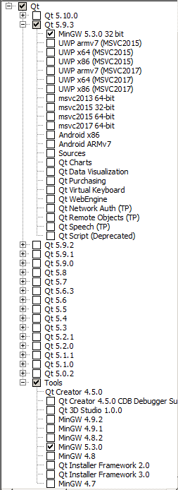

# Windows - MinGW

## Introduction

From revision [5b7c72a](https://github.com/MuseScore/musescore/commit/5b7c72a) onwards, committed 5th January 2018, the development version of MuseScore (master) on Windows requires Qt 5.9 or newer and a C++11 capable toolchain.  
From revision [0128daf](https://github.com/MuseScore/musescore/commit/0128daf) onwards, committed 1st November 2018, the development version of MuseScore (master) on Windows also builds with Qt 5.12 (and therefore in 64bit mode, since Qt 5.12.2 32bit is also possible). To build with Qt 5.9 or anything prior to Qt 5.12 (and therefore in 32bit mode only), or using MinGW 32-bit in Qt 5.12.2 and later, the BUILD_64 setting needs to get switched off manually, this doesn't get detected automatically

To prevent any compatibility issues, it is essential to compile MuseScore with the same type and version of compiler as was used to build Qt.

## What you need

### Tools

The following tools need to get installed on your computer.

#### 7-Zip utility

Some of the files to be downloaded are compressed using 7-Zip compression. If necessary, download and install [7-Zip](http://www.7-zip.org/download.html).

#### MinGW 5.3.0 and Qt 5.9 (or MinGW 7.3.0 and Qt 5.12)

Fresh install:
Download the [Qt Online Installer for Windows](http://www.qt.io/download-open-source).

There are a number of Windows installers on this page - make sure it is the __Online Installer__ you are downloading.

Run the installer and install Qt in `C:\Qt`. You just need the Qt libraries for MinGW 5.3.0 and the MinGW 5.3.0 toolchain (or those for MinGW 7.3.0



(optional) Add the following directories to your `%PATH%`

```text
C:\Qt\Tools\mingw530_32\bin
C:\Qt\Tools\mingw530_32\lib
C:\Qt\5.9.9\mingw53_32\bin
C:\Qt\Tools\QtCreator\bin
```

Update to Qt 5.9.9  
Launch the Qt Maintenance Tool (C:\Qt\MaintenanceTool.exe).
First this tool will need to update itself, so select the `Update components` option. Once you've gone through all the steps, press the `Restart` button.

For this 2nd pass, select the `Add or remove components` option. In the select components screen, your currently installed components are preselected. Make sure to add ticks for the Qt libraries for MinGW 5.3.0 and that toolchain (see image from fresh install above).

#### CMake

Download the latest version of windows binaries for [CMake](http://www.cmake.org/cmake/resources/software.html). Choose the __Windows (Win32 Installer)__ version. You need at least version 3.0. Versions up to 3.11.3 are known to work too (3.11 may emit some warnings reg. decrecated policies though). 3.5.1 is known to cause issues if not last in `PATH`.

Install in the default location (probably `C:\Program Files\CMake` or `C:\Program Files (x86)\CMake`) and optionally put the bin subdirectory into your `PATH`.  
For 3.5 and later make sure it is in PATH after the 3 Qt mingw directories (see above).

#### Source Code

Get the source code from [GitHub](https://github.com/musescore/MuseScore). If you need a Git client, you can try [Git for Windows](http://msysgit.github.com) or the [GitHub windows client](http://windows.github.com).

```cmd
git clone git://github.com/musescore/MuseScore.git
```

If you plan to contribute to MuseScore, you can setup your own fork on GitHub and clone it instead. See the [Git workflow](../WorkflowAndGuidelines/GitWorkflow.md) page.

NOTE: Directory names with spaces in them cause the build to fail; so avoid spaces in the name of your clone directory.

#### %PATH% summary

You must have the following in your %PATH%:

```text
C:\Qt\Tools\mingw530_32\bin (or wherever MinGW is installed for you)
C:\Qt\Tools\mingw530_32\lib (or wherever MinGW is installed for you)
C:\Qt\5.9.9\mingw53_32\bin (or wherever Qt is installed for you)
C:\Program Files\CMake\bin (or wherever you installed CMake)
C:\Qt\Tools\QtCreator\bin If you want to launch QtCreator from the command line
```

NOTE: You can add path elements to cmd shells via Computer / System Properties / Advanced System Settings / Environment Variables. However, the make process can be sensitive to the rest of the contents of your %PATH% as well. If you encounter issues like mingw32-make immediately terminating with error code 0xc00000fd, then try stripping your path down to only the above elements, plus perhaps C:\Windows and C:\Windows\System32. You might consider running the build from a batch file that temporarily sets your %PATH% to just the required elements.

A good approach to doing so is to create the following batch file in the "C:\Qt" folder:
__C:\Qt\qt.bat__

```cmd
@echo off
echo Setting up a MinGW/Qt only environment...
echo -- Set QTDIR to C:\Qt\5.9.9\mingw53_32
set QTDIR=C:\Qt\5.9.9\mingw53_32
echo -- Set PATH to %QTDIR%\bin
set PATH=%QTDIR%\bin
echo -- Adding C:\Qt\Tools\mingw530_32\bin;C:\Qt\Tools\mingw530_32\lib to PATH
set PATH=%PATH%;C:\Qt\Tools\mingw530_32\bin;C:\Qt\Tools\mingw530_32\lib
echo -- Adding %ProgramFiles%\CMake\bin
set PATH=%PATH%;%ProgramFiles%\CMake\bin
echo -- Adding to C:\Qt\Tools\QtCreator\bin
set PATH=%PATH%;C:\Qt\Tools\QtCreator\bin
echo -- Adding %SystemRoot%\System32 to PATH
set PATH=%PATH%;%SystemRoot%\System32
echo -- QMAKESPEC set to win32-g++
set QMAKESPEC=win32-g++
cd %USERPROFILE%
echo -- Set MAKEFLAGS to -j %NUMBER_OF_PRCESSORS%
set MAKEFLAGS=-j %NUMBER_OF_PROCESSORS%
rem un-rem the last line to start Qt Creator immediately
rem using /low makes sure you can still work with the PC
rem -lastsession gets you back where you left
rem start "" /low qtcreator -lastsession
```

Then create a shortcut to this batch file somewhere in the Programs menu. If starting QtCreator immediately, the shortcut can be set to "Start minimized".

(NOTE: if you don't want to launch qtcreator from a bat file, you can still set MAKEFLAGS to a hardcoded value directly inside of qtcreator by going to Projects->Build->"Build Environment" and adding a variable MAKEFLAGS with value "-j 4" for 4 or any number of compile threads.)

### Dependencies

There are several additional dependencies:

* LAME
* libogg
* libsndfile
* libvorbis
* libvorbisfile
* Portaudio
* WinSparkle
* zlib

All of these are open-source projects. Although it is possible to download them individually and build them yourself to create the required libraries, it is much easier to use prebuilt libraries and include files.
Download and extract the contents of [dependencies.7z](https://s3.amazonaws.com/utils.musescore.org/dependencies.7z) into the MuseScore checkout folder. (This will create a new dependencies subfolder within.)

## Compilation

If you wish to use the QtCreator IDE, follow the instructions in section "Qt Creator IDE", below.

Open a command line, possibly using a batch file such as qt.bat given above.
Browse to the directory where you checked out musescore
Enter

```cmd
mingw32-make -f Makefile.mingw release
```

or

```cmd
mingw32-make -f Makefile.mingw debug
```

Note that the two options internally set different flags for the compiler. In debug mode the `QT_DEBUG` flag is used, so conditional code controlled by `#ifdef QT_DEBUG` is compiled. In release mode `NDEBUG` is set. Unless you are building a release, it is suggested that you use the "debug" option, like in the section on the Qt Creator IDE (below).

Be patient ... On my Vista laptop (Intel T7550) it takes more than one hour to build. Build times on Windows can be more than twice as long as build times on Ubuntu (using the same computer). Once the compilation finishes, the MuseScore executable can be found in `build.release/mscore/MuseScore.exe` or `build.debug/mscore/MuseScore.exe`. So long as `C:\Qt\Tools\mingw48_32\lib` is in the `PATH`, it should not be necessary to copy any DLLs. However, it has been found necessary to copy the complete directories iconengines and imageformats from `%QTDIR%\plugins` to the `build.release/mscore` or `build.debug/mscore` directory (resulting in, for example, `build.debug/mscore/iconengines`. This should be sufficient for most development work.

NOTE: You may need to go into the preferences, and fix the paths to have Windows-style slash characters (backslash), or you may see error messages about not being able to open files. [Is this a bug?]

If you need the language files, instrument list, templates, and the normal directory structure of a installed version of MuseScore then type:

```cmd
mingw32-make -f Makefile.mingw install
```

or, for a debug build:

```cmd
mingw32-make -f Makefile.mingw installdebug
```

Once install has finished look in the current directory for win32install/bin/MuseScore.exe. In this case there is no need to copy DLLs or the plugins directories, as they are already copied during the make process.
