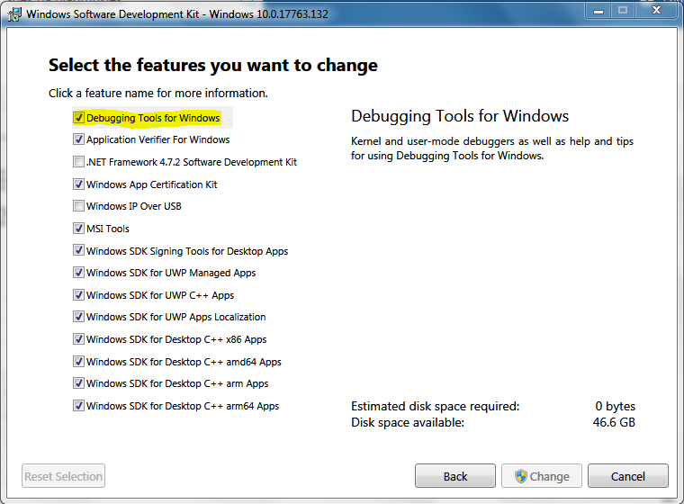

# Windows - MSVC with Qt Creator

This page is instructions for how to use the MSVC compiler inside the Qt Creator IDE.

Microsoft makes their build tools available separately to the Visual Studio IDE, so there is no need to install Visual Studio if you plan to use a different IDE.

## Getting the MSVC compiler

### If Visual Studio is already installed

You need to run its installer again and modify your installation to include the C++ Build Tools. If you followed the main MSVC guide then these will already be installed.

### If Visual Studio is not already installed

You only need the build tools, but you can upgrade to a full Visual Studio installation later if necessary. To install only the C++ build tools:

1. Visit [this page](https://visualstudio.microsoft.com/downloads) and scroll down to __All Downloads__.
2. Expand the __Tools for Visual Studio__ section.
3. Download __Build Tools for Visual Studio__.

Run the installer you downloaded, and when you get the the __Workloads__ screen, ensure the __C++ build tools__ option is checked. That's the only thing you need.

You can _optionally_ look under the __Individual components__ tab, where you should see the following items checked:

* Under __Compilers, build tools and runtimes__
  * C++ [year] Redistributable Update
  * C++ CMake Tools for Windows
  * MSVC v[version] - VS [year] - C++ x64/86 build tools (v[version])
* Under __Debugging and testing__
  * Testing tools core features - Build Tools
* Under __Development activities__
  * C++ Build Tools core features
* Under __SDKs, libraries and frameworks__
  * Windows 10 SDK ([version])
  * Windows Universal C Runtime

It's possible that you don't need all of those components, but installing them does no harm (assuming you have enough space on your drive).

## Getting the CDB debugger

The Windows 10 SDK offered with the Build Tools installer does not include debugging tools by default. To get the CDB debugger for Windows, you need to modify the SDK installation to include it.

1. In the __Start menu__, search for __Add or remove programs__ and open it.
2. Find __Windows Software Development Kit__ in the list of installed programs.
3. Click on it and select __Modify__. An installation dialog pop up.
4. Select __Change__ and click Next. You should see this screen:



Select the __Debugging Tools for Windows__ option and click Change.

## Getting the Qt libraries and Qt Creator

If you already have Qt installed then you can simply run the Maintenance Tool that came with it (the tool is in C:\Qt or wherever you installed Qt). If you don't have Qt already installed, you need to download the [Qt Online Installer for Windows](https://www.qt.io/download-qt-installer) and run that instead.

Ensure the following components are checked within the Maintenance Tool / Online Installer:

* Under the __latest Qt 5.12__ (currently Qt 5.12.6, ignore 5.12.7, 5.13 and later for now)
  * Select the prebuilt libraries for __your MSVC compiler version__ (e.g. MSVC 2017 64-bit)
    * The MSVC year __does not__ have to match the version you installed earlier (though ideally it should)
    * The MSVC architecture __must__ match the version you installed earlier
      * __32 bit Windows__: you must install the 32 bit libraries
      * __64 bit Windows__: you can choose either the 32 or 64 bit libraries, or both!
        * If in doubt, install only the 64 bit libraries. That is enough to compile MuseScore for your own machine. The 32 bit libraries are only useful if you want to compile for 32 bit computers.
  * Select Qt WebEngine

If you want to be able to debug within Qt Creator (recommended), also check:

* Under __Developer and Designer Tools__
  * Qt Creator (cannot be deselected)
  * Qt Creator CDB Debugger Support

Click __Next__ to install these components.

## Getting the other dependencies

Download [dependencies.7z](https://s3.amazonaws.com/utils.musescore.org/dependencies.7z) and extract the contents into the base directory. (This will create a new dependencies folder in that base directory.)

Also install Jack.

## Compiling with Visual Studio 2019

If you are using VS 2019, you will need to update `msvc_build.bat` and `CMakeSettings.json`.

Replace any instances of

* `Visual Studio 15 2017`
* `Visual Studio 15 2017 Win64`

with

* `Visual Studio 16 2019`

(Make sure to remove Win64)

## Compiling on the command line

It's a good idea to make sure you can compile from the command line before you try to set up an IDE.

The following batch script has the commands need to set up the build environment and compile MuseScore. Modify the paths as neccesary for your machine, then save the file as `mybuild.bat` inside your MuseScore code repostory.

```cmd
REM Set up build environment
CALL "C:\Program Files (x86)\Microsoft Visual Studio\2019\BuildTools\VC\Auxiliary\Build\vcvars64.bat"

REM Add Qt to PATH
SET "PATH=C:\Qt\5.12.6\msvc2017_64\bin;%PATH%"

REM Build MuseScore
msvc_build.bat relwithdebinfo
```

Add this file's name to `.git/info/exclude` to prevent it from being checked-in to the repository.

To run the script:

1. In the Start menu, search for CMD.
2. Type cd (change directory) followed by a space and the path to your MuseScore code repository  
 e.g. `cd C:\Users\[username]\MuseScore`  
 Press Enter to run the `cd` command
3. Type the name of the file mybuild.bat and press Enter to run it.
4. If you need to run it again, simply press the Up arrow key to get the previous command back and press Enter to run it again.

The following shortcuts make command prompt much easier to use:

* __Up and Down arrow keys__: cycle through commands previously typed in this session
* __Tab key__: autocomplete a command, filename, or path (i.e. type a few characters then press Tab)
* __Ctrl+C__: stop a command that is taking a long time to complete
* __Ctrl+Shift+C__ copy highlighted text (must be enabled in CMD Properties, see below)
* __Ctrl+Shift+V__ paste text (must be enabled in CMD Properties, see below)

Clicking the CMD icon in the top left corner of the window brings up a menu with useful options, including Edit and Properties. You might want to go into Properties and enable "Use Ctrl+Shift+C/V as Copy/Paste". These are the standard copy and paste shortcuts available in most Command Prompt / Terminal applications on Windows and Linux.

## Working in Qt Creator

IDEs are convenient for experienced users, but they introduce another layer of complexity. If something goes wrong then you might not know whether the issue is with the IDE or the compiler.

### Editing files

To retain control over the compile process, you could choose to ignore Qt Creator's IDE features and just use it as a text editor for MuseScore's .cpp, .h and .ui files. Simply keep your Command Prompt open in a separate window, and press Up and Enter every time you want to recompile.

To set up a basic project where Qt Creator is only used as a text editor:

1. Within Qt Creator, go to File → New File or Project
2. Select "Import Project" and "Import Existing Project"
3. Enter project details:  
 Name: "MuseScore" (or "MuseScore_Windows" if you share this folder with another OS)  
 Location: "~/src/MuseScore" (or wherever the Git repo is on your system)
4. Choose the files to include in the project:  
   * Filter the list by filetype:  
     * Add *.ui to the list of types shown  
     * Add * to the list of types hidden (hides everything else)  
     * Now apply the filter.  
   * Choose which files to include:
     * Uncheck all directories except libmscore, mscore and mtest 
   * Click "Next".  
5. [Optional] Add the project to Git version control.
   * You may prefer to use Git from the command line (recommended) or an external GUI tool.
6. Click "Finish".

### Debugging

You can debug inside Qt Creator even if the program wasn't built in Qt Creator.

To set this up within your Qt Creator project:

1. Click Projects in the left panel
2. Find your Build Kit (e.g. Desktop Qt 5.12.6 MSVC2017 64-bit) on the left (you may only have one).
3. Click the Run button to edit the run configuration and set the following:
   * Executable: `msvc.install_x64\bin\MuseScore3.exe`
   * Arguments: `-F` (if you always want to debug in MuseScore's initial state)
   * Working directory: `%{buildDir}`

Now when you want to debug, go to the Debug menu > Start debugging > Start debugging without deployment.

If you try to debug and see the message "Unable to create a debugging engine", make sure that you installed the Debugging Tools inside the Windows SDK and installed CDB Debugger Support in Qt Creator as explained earlier. If it still doesn't work then go to the Projects tab in the left panel, click "Manage Kits" and make sure the correct debugger is selected for you chosen kit.

### Custom compilation

To avoid having to open CMD, you can tell Qt Creator to run your mybuild.bat script for you every time you press a compile button with Qt Creator itself. This gives you the best of both worlds: you get the convenience of an IDE but still have the flexibility and reliability of a separate build script.

To get Qt Creator to use your build script:

1. Click Projects in the left panel
2. Find your Build Kit (e.g. Desktop Qt 5.12.6 MSVC2017 64-bit) on the left (you may only have one).
3. Click the Build button to edit the build configuration and do the following:
   * Delete any existing Build Steps, then click Add Build Step > Custom Process Step
     * Command: `mybuild.bat`
     * Working directory: `%{buildDir}`
   * Delete any existing Clean Steps, then click Add Clean Step > Custom Process Step
     * Command: `msvc_build.bat`
     * Arguments: `clean`
     * Working directory: `%{buildDir}`

Now when you want to build, simply press the big green triangle with the bug in the bottom left of the screen. When you want to delete the build files and start again, go to the Build menu and choose "Clean Project".

### Full project set-up

MuseScore uses the CMake build system. The "proper" way to set up a CMake project in Qt Creator is as follows:

1. Go to File > Open File or Project
2. Choose MuseScore's top-level CMakeLists.txt file

Qt Creator will spend a few minutes "configuring" the project, but once that's done everything is set up all ready for you to click "build". There's no need to go messing around with build and debug configurations, as Qt Creator does this automatically. At least, that's the theory...

In practice, the automatic method is vulnerable to changes in the CMake files, and it tends to break fairly often without reason. This forces you to run the configuration again, which takes a few minutes in Qt Creator (and other IDEs) but only takes a couple of seconds on the command line.

Ultimately, the most reliable way to compile is to copy whatever is done inside the build scripts used for MuseScore's CI tests. Build scripts will always use a command line method rather than an IDE.
