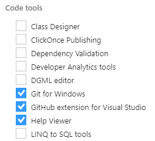
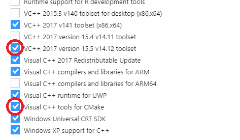
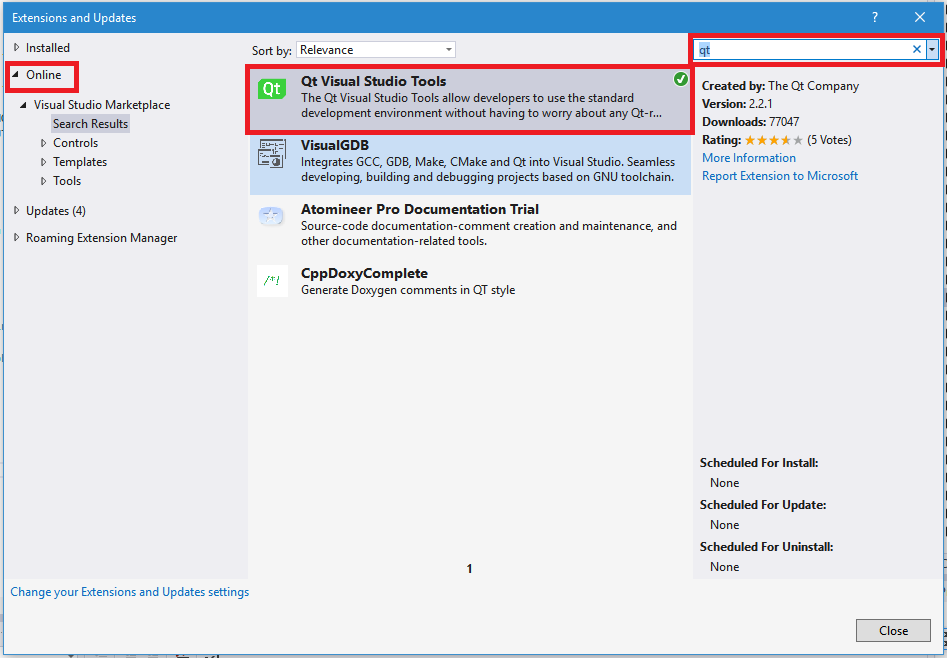

# Windows - Visual Studio

NOTE: These instructions are for building MuseScore using the Microsoft Visual Studio (VS) integrated development environment with the Microsoft Visual C++ (MSVC) compiler. If you are familiar with the QtCreator IDE or want a better experience editing .ui files, see the [instructions for Qt Creator and MSVC](https://musescore.org/en/handbook/developers-handbook/compilation/compile-instructions-windows-visual-studio/compile) instead.

__Maintainers__: This guide is currently valid for Visual Studio 2017 and 2019. Please update it for future VS versions rather than creating a new one.

## Prerequisites

You will need the MuseScore source code, as well as several programs and libraries, to be able to build MuseScore with Visual Studio.

### MuseScore source code

* Check out the MuseScore source code (see the [Git workflow](../WorkflowAndGuidelines/GitWorkflow.md)).
* Make sure that the path to your MuseScore checkout folder:
  * isn't too long
  * doesn't contain any spaces
  * doesn't contain any non-ASCII letters (e.g., a Cyrillic username).
* If you're using VS2017: Modify CMakeSettings.json and replace all occurrences of Visual Studio 15 2019 with Visual Studio 15 2017. Make sure not to commit these changes to any pull requests.

### Visual Studio

These instructions are for building MuseScore under VS2017 and VS2019. Any edition of these versions of Visual Studio will work, including the Community edition, which is full-featured and free to use for open-source projects.

Whether or not you already have Visual Studio installed, please read these instructions carefully, as you might need to install some additional components.

* If you do not already have VS2017 or VS2019 installed, download [Visual Studio Community](https://visualstudio.microsoft.com/vs/community)
* When you run the Visual Studio installer (either for the first time, or after installing, to change options), you will get eventually to the Workloads tab. Make sure the Desktop development with C++ option is selected.

* Switch to the _Individual components_ tab and make sure the following options are all selected:
  * For VS2017:
    * Code tools:
      * Git for Windows
      * GitHub Extension for Visual Studio
      * Help Viewer  

    * Compilers, build tools, and runtimes:
      * Visual C++ tools for CMake
      * VC++ 2017 version 15.9 v14.16 latest v141 tools (or the latest version available)  

  * For VS2019:
    * Code tools:
      * Git for Windows
      * Help Viewer
    * Compilers, build tools, and runtimes:
      * C++ CMake tools for Windows
      * MSVC v142 - VS 2019 C++ x64/x86 build tools (v14.25) (or the latest version available)
    * Uncategorized:
      * GitHub Extension for Visual Studio
* Now, let it install (or update), grab a coffee (or a tea, a soda, a beer… whatever you prefer), and be patient.
* Once Visual Studio has been installed, start it and link it with your Microsoft account. (If you don't have one, create one).
* Go to Tools > Extensions and Updates… (in VS2017) or Extensions > Manage Extensions (in VS2019). On the left side of the dialog, select Online, then enter “qt” in the search box at the top right, and select and install Qt Visual Studio Tools. Although this is not strictly needed, it can be handy later.  
  
* While you are here, you can go to Tools > Options… and review and edit the editor options to your liking. (This can be done per-language, and there are tons of settings!)

### CMake

CMake is used for generating the Visual Studio solution and project files needed for building MuseScore.

If you're building a [standard build](#standard-build), Visual Studio will automatically use its own internal copy of CMake, so you don't need to download it separately.

If you're building an [advanced build](#advanced_build), you will need to download and install CMake.

(For information on the difference between standard and advanced builds, see [building](#building).)

* Download and install [CMake](https://cmake.org/download).
* Add the CMake bin subfolder to the Path environment variable; typically, this will be `%ProgramFiles%\CMake\bin`.

### Qt

You will need the Qt libraries, either version 5.9.9 or 5.12.8, to be able to build MuseScore.

* Go to [Download Qt: Get Qt Online Installer](https://www.qt.io/download-qt-installer) and follow the steps to download and launch the online installer.
* Install Qt in the default location.
* Choose a Qt version (either 5.9.9 or 5.12.8) and install the following components for that version:
  * MSVC 2017 64-bit (this will work for for both VS2017 and VS2019)
  * Qt WebEngine
  * Optional, for 32-bit builds of MuseScore: MSVC 2017 32-bit (not available for Qt 5.9.9; instead, install MSVC 2015 32-bit, which will also work for VS2017 and VS2019)
  * Optional, to make debugging easier: Qt Debug Information Files (not available for Qt 5.9.9)
* Add the path of the Qt `bin` subfolder (e.g., `C:\Qt\5.12.8\msvc2017_64\bin`) to the `PATH` environment variable.
Tip: If you get CMake “can't find resource” failures later on, it's probably because the path of the Qt `bin` subfolder has not been correctly added to the `PATH` environment variable.
* Remove the MinGW `C:\Qt\5.*\mingw*\bin` folder from the `PATH` environment variable, if present.

### JACK

* Download the 64-bit Windows installer for the latest version of [JACK](https://github.com/jackaudio/jackaudio.github.com/releases).
* Install JACK in the default location.

### 7-Zip

You will need a utility that handles `.7z` compressed files. [7-Zip](https://www.7-zip.org) is open-source, free, and quite powerful, but there are alternatives that will work as well.

### Additional dependencies

There are several additional dependencies:

* LAME
* libogg
* libsndfile
* libvorbis
* libvorbisfile
* Portaudio
* WinSparkle
* zlib

All of these are open-source projects. Although it is possible to download them individually and build them yourself to create the required libraries, it is much easier to use prebuilt libraries and include files.

* Download [dependencies.7z](https://s3.amazonaws.com/utils.musescore.org/dependencies.7z).
* Extract the contents of `dependencies.7z` into the MuseScore checkout folder. (This will create a new dependencies subfolder within.)

## Building

MuseScore can be built in three different configurations:

* `Release`: Runs fast with all performance optimizations enabled, but very difficult to debug.
* `Debug`: Very easy to debug, but runs very slow because all performance optimizations have been disabled.
* `RelWithDebInfo`: A compromise between `Release` and `Debug`. Runs faster than `Debug` but is more difficult to debug; conversely, easier to debug than `Release` but runs somewhat slower.

For each of these three configurations, MuseScore can be built for either 32-bit or 64-bit Windows.

A standard build of MuseScore uses the `RelWithDebInfo` configuration for 64-bit Windows. To build this, follow the procedure for a standard build.

To build MuseScore in other configurations, or for 32-bit Windows, follow the instructions for advanced builds.

### Standard build

* Open Visual Studio.
* Go to File > Open > Folder… and open the MuseScore checkout folder.  

Visual Studio will automatically begin to generate a CMake cache, which will include the Visual Studio solution and project files.  

In Visual Studio, a solution is a collection of projects, grouped together, and sharing some basic characteristics. A project corresponds to a specific output being generated (such as an executable or a library). A project can exist by itself or within a solution, and a solution can contain one or more projects. CMake creates a single solution, with a different project for each logical component of MuseScore. The MuseScore solution contains over two dozen projects.  

CMake cache generation will take a while. Watch the Output window and wait for the completion message to appear:

* VS2017: Target info extraction done.
* VS2019: CMake generation finished.

If everything has worked as it should, Visual Studio will have created a Visual Studio solution file called `mscore.sln` inside the `msvc.build_x64` subfolder of the MuseScore checkout folder, along with a collection of Visual Studio project files (*.vcxproj).

* Go to File > Close Folder to close the MuseScore checkout folder.
* Go to File > Open > Project/Solution…, then navigate to the `msvc.build_x64` folder and open the `mscore.sln` Visual Studio solution file.

The Solution Explorer window should look like this:

Note the small red “minus sign” icons to the left of each project. Those icons mean that the project files are being excluded from the Git repository. Any directories or files with this icon are excluded and will not be included in any commits that you make.

* In the Solution Explorer window, select the mscore project, then go to _Build > Build mscore_. (Alternatively, right-click the _mscore_ project and choose _Build_ from the popup menu.)

Building will take a while. Visual Studio will automatically build all of the other projects that mscore depends on. Watch the Output window and wait for the completion message to appear:  
`========== Build: 25 succeeded, 0 failed, 0 up-to-date, 0 skipped ==========`

* In the Solution Explorer window, select the _INSTALL_ project, then go to _Build > Build INSTALL_. (Alternatively, right-click the _INSTALL_ project and choose _Build_ from the popup menu.)

Watch the Output window and wait for the completion message to appear:  
`========== Build: 1 succeeded, 0 failed, 0 up-to-date, 0 skipped ==========`

NOTE: Although building the _INSTALL_ project is required, it need be done only once. Unless you change external resources (e.g. templates, workspaces, soundfonts, or translations) or change the build configuration, there is no need to build the _INSTALL_ project again.

### Advanced builds

To generate an advanced build, use the `msvc_build.bat` batch file at a Command Prompt instead of building from within Visual Studio.

1. Exit Visual Studio if it's running.
2. Delete the `msvc.build_x64` or `msvc.build_x86` and `msvc.install_x64` or `msvc.install_x86` subfolders of the MuseScore checkout folder or run `msvc_build.bat clean`
3. Make sure that CMake is installed and that its bin subfolder has been added to the `PATH` environment variable.
4. Make sure that the `bin` subfolder of an appropriate build of Qt (e.g., 32-bit for a 32-bit build) is the one that has been added to the Path environment variable.
5. Open the `msvc_build.bat` batch file in a text editor (such as Notepad) to read the instructions in the comments at the beginning of the file.
6. Run the `msvc_build.bat` batch with the options you thing to need, e.g. `msvc_build.bat RelWithDebInfo 32`.

## Running

Run `MuseScore3.exe` from inside the `msvc.install_x64\bin` or `msvc.install_x86\bin` subfolder of the MuseScore checkout folder. (Do __not__ run the copy of `MuseScore3.exe` inside the `msvc.build_x64\main\RelWithDebInfo` or `msvc.build_x86\main\RelWithDebInfo` subfolder of the MuseScore checkout folder.)

## Debugging

* Click the -> Local Windows Debugger button on the main toolbar, or go to Debug > Start Debugging, or press `F5`.
* Watch the Output window for debug messages.